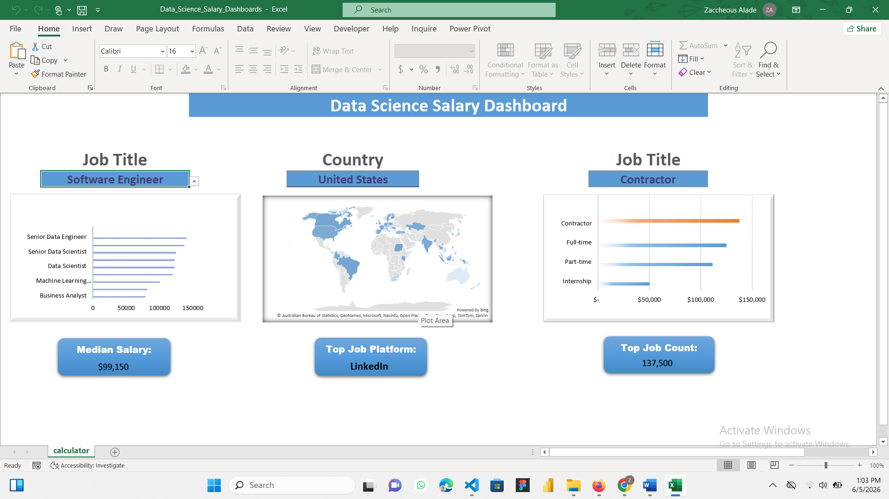

# 📊 Data Science Salary Dashboard



## 🌟 Project Overview

The data industry continues to experience rapid growth, creating new opportunities for professionals across Data Analytics, Data Science, Machine Learning, and Software Engineering. However, salary expectations often vary significantly based on job title, location, and employment type.

To better understand these trends, I developed an interactive Excel dashboard that analyzes real-world job market data and provides insights into salary distribution across various dimensions.

This dashboard enables users to explore salary trends, compare compensation across countries, evaluate different employment types, and identify the most active job platforms through an intuitive and interactive interface.


# 🎯 Business Problem

Job seekers and professionals frequently ask:

* Which data-related roles offer the highest salaries?
* How do salaries vary across countries?
* Does employment type affect earning potential?
* Which job platforms have the highest number of opportunities?

Without data-driven analysis, answering these questions can be difficult.

This project was created to transform raw job market data into meaningful insights that support informed career decisions.


# 📂 Dataset

The dataset contains real-world job posting information, including:

* 💼 Job Titles
* 💰 Salary Information
* 🌍 Countries
* 🏢 Job Platforms
* ⏰ Job Schedule Types
* 📊 Job Posting Data

The data was analyzed and transformed within Microsoft Excel to build a dynamic reporting solution.


# 🛠️ Tools & Skills Used

### Microsoft Excel

The following Excel skills were utilized throughout this project:

* 📈 Charts & Data Visualization
* 🧮 Advanced Formulas
* ❎ Data Validation
* 🔍 Lookup Functions
* 📊 Dashboard Design
* 📋 Structured Tables
* 📑 Data Analysis


# 📊 Dashboard Overview

The final dashboard was designed to provide a simple, interactive, and user-friendly experience for exploring salary trends within the data industry.


### Dashboard Components

#### 🎯 Job Title Analysis

The dashboard includes a job title filter that allows users to explore salary trends across different roles.

Users can quickly compare salaries between positions such as:

* Data Scientist
* Data Engineer
* Software Engineer
* Business Analyst
* Machine Learning Engineer

This helps identify which roles command higher compensation and highlights potential career progression opportunities.

--

#### 🌍 Country Salary Analysis

The dashboard features an interactive map visualization showing salary distribution across different countries.

This visualization helps users:

* Compare salaries globally
* Identify high-paying regions
* Explore geographic salary trends
* Understand regional compensation differences

--

#### ⏰ Job Schedule Type Analysis

The dashboard analyzes salary information across employment types, including:

* Full-Time
* Part-Time
* Contract
* Internship

This allows users to evaluate how employment arrangements influence compensation levels.

-

# 📌 Key Performance Indicators (KPIs)

The dashboard includes dynamic KPI cards that automatically update based on user selections.

### 💰 Median Salary

Displays the median salary based on selected filters.

### 🏆 Top Job Platform

Highlights the platform with the highest number of job postings.

### 📈 Top Job Count

Displays the highest number of available job opportunities for the selected criteria.

These KPIs provide quick insights without requiring users to manually analyze large amounts of data.

-

# ❎ Data Validation & Interactivity

To improve user experience and maintain data integrity, Data Validation was implemented throughout the dashboard.


### Benefits

* Restricts selections to valid options
* Prevents incorrect user input
* Enhances dashboard usability
* Supports dynamic filtering and reporting

Dropdown menus allow users to filter data by:

* Job Title
* Country
* Job Schedule Type

This creates a fully interactive dashboard experience.

-

# 🧮 Formula Logic

One of the key calculations used in this project is the dynamic median salary formula.

```excel
=MEDIAN(
IF(
(jobs[job_title_short]=A2)*
(jobs[job_country]=country)*
(ISNUMBER(SEARCH(type,jobs[job_schedule_type])))*
(jobs[salary_year_avg]<>0),
jobs[salary_year_avg]
)
)
```

### Formula Purpose

This formula calculates the median salary based on multiple criteria:

* Selected Job Title
* Selected Country
* Selected Employment Type

By combining several conditions, the dashboard generates personalized salary insights that automatically respond to user selections.

-

# 📈 Key Insights

The analysis revealed several important trends within the data job market.

### 💡 Higher-Level Roles Earn More

Senior and specialized positions generally command higher salaries than entry-level roles.

### 💡 Location Significantly Impacts Compensation

Salary expectations vary considerably across countries and regions.

### 💡 Employment Type Influences Earnings

Different work arrangements can result in substantial differences in compensation.

### 💡 Data Supports Better Career Decisions

Using real job market data provides a clearer understanding of career opportunities and salary expectations.


# 🚀 Skills Demonstrated

This project showcases my ability to:

* Clean and structure datasets
* Build interactive Excel dashboards
* Apply advanced Excel formulas
* Implement data validation systems
* Analyze salary trends
* Create business-focused visualizations
* Transform raw data into actionable insights
* Communicate findings through data storytelling

-

# 🏁 Conclusion

This project demonstrates how Microsoft Excel can be leveraged as a powerful analytics and business intelligence tool to analyze real-world job market data.

By combining advanced formulas, interactive filtering, data validation, and visual reporting techniques, I transformed raw salary data into an interactive dashboard capable of answering important questions about compensation trends across job roles, countries, and employment types.

Beyond the technical implementation, this project strengthened my ability to think like a data analyst—identifying business problems, organizing data, building analytical solutions, and communicating insights that support informed decision-making.

The most valuable lesson from this project is that data becomes truly impactful when it is transformed into information that helps people make better decisions.

-

# 👨‍💻 Author

## Zacch
**Python Djnago Developer| Data Analyst | Excel Analyst | Data Visualization Enthusiast**

Passionate about transforming raw data into meaningful insights through analytics, dashboard development, and data storytelling.


If you found this project interesting, feel free to connect with me and explore my other analytics projects.
