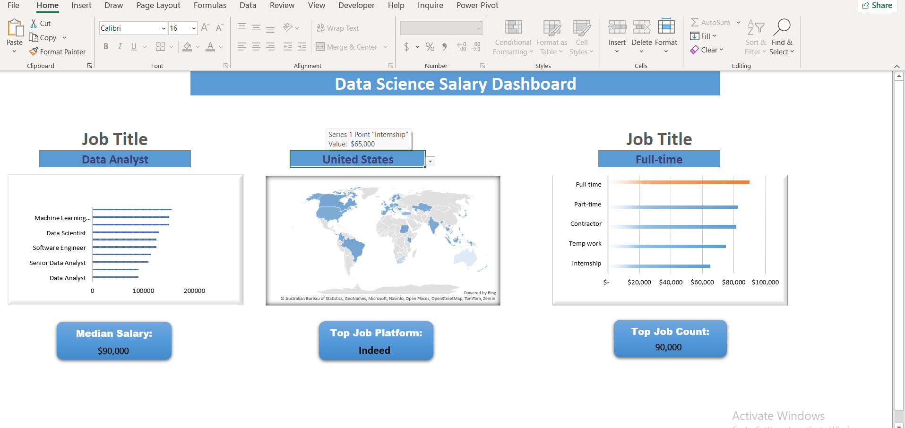
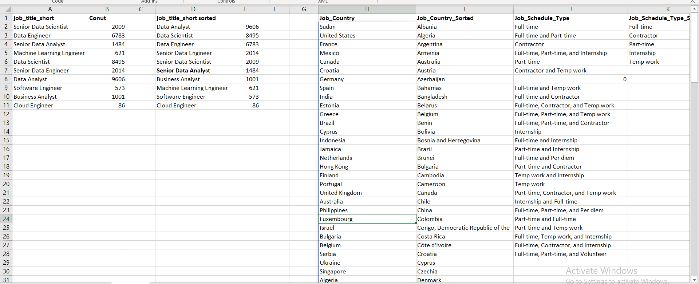

# 📊 Data Science Salary Dashboard Analysis

## Overview

The data industry is one of the fastest-growing sectors in the world, yet salary expectations often vary significantly across job roles, locations, and skill sets. For aspiring professionals and experienced practitioners alike, understanding these salary trends is essential for making informed career decisions.

In this project, I developed an interactive Excel dashboard that analyzes real-world Data Science job market data. Using Excel's advanced analytical capabilities, I transformed raw datasets into a dynamic reporting solution that enables users to explore salary patterns, compare job roles, evaluate skills, and identify career opportunities within the data industry.

This project demonstrates my ability to move beyond basic spreadsheet analysis by applying data cleaning, transformation, modeling, visualization, and business intelligence techniques to generate meaningful insights.

---

# 🎯 Business Problem

Professionals entering the data field often face important questions:

* Which data roles offer the highest salaries?
* Which skills are associated with higher compensation?
* How does location influence earning potential?
* What career paths provide the strongest growth opportunities?

Without data-driven insights, these questions are often answered through assumptions rather than evidence.

The goal of this project was to build an interactive dashboard capable of helping users explore salary trends and make informed career decisions using real-world job market data.

---

# 📂 Dataset Information

The dataset contains Data Science job posting information from 2023 and includes:

* 💼 Job Titles
* 💰 Annual Salary Information
* 🌍 Job Locations
* 🏢 Employment Types
* 🛠️ Required Skills
* 📊 Job Market Data

The data was imported into Excel and prepared for analysis using Power Query and Excel's Data Model.

---

# 🛠 Tools & Skills Used

### Microsoft Excel

The project was built entirely in Microsoft Excel using:

* Power Query
* Data Cleaning
* Data Transformation
* Data Modeling
* Pivot Tables
* Pivot Charts
* DAX Measures
* XLOOKUP
* Data Validation
* Dashboard Design
* Data Visualization

---

# 🔄 Data Preparation & Transformation

Before any analysis could be performed, the raw datasets required cleaning and transformation.

### Salary Dataset Transformation

## Key Transformation Activities

* Reviewed dataset structure and quality
* Standardized data formats
* Removed unnecessary fields
* Organized salary information
* Prepared skills data for analysis
* Loaded transformed datasets into Excel's Data Model

Power Query significantly streamlined the ETL (Extract, Transform, Load) process and provided a scalable foundation for the dashboard.

-

# 🏗 Data Modeling

After transforming the datasets, they were loaded into Excel's Data Model to support advanced analysis.

The Data Model enabled efficient relationships between datasets and supported more advanced calculations through Pivot Tables and DAX measures.

# 📊 Dashboard Development

The dashboard was designed to provide a user-friendly and interactive experience for exploring salary and skills data.

## Final Dashboard

### Dashboard Features

✔ Dynamic filtering

✔ Salary comparison by role

✔ Skill-based analysis

✔ Interactive reporting

✔ Automated calculations

✔ Career-focused insights

Users can explore different job positions, compare salaries, and evaluate how skills influence compensation levels across the data industry.

---

# 💰 Salary Analysis

A key component of the dashboard focuses on salary trends across different job roles.

### Insights

* Senior-level positions generally command significantly higher salaries.
* Technical and engineering-focused roles tend to outperform many entry-level analytical positions.
* Salary distribution varies substantially across job categories.
* Specialized expertise often correlates with stronger earning potential.

---

# 🧠 Skills Analysis

Understanding which skills drive compensation is critical for career development.

The skills analysis section helps identify which technical competencies appear most frequently across data-related careers.

### Key Observations

* Technical skills remain highly valued across the industry.
* Certain skills appear consistently across high-paying roles.
* Skill diversification increases opportunities across multiple career paths.

---

# 📈 Salary vs Skills Analysis

This section combines salary information with skill requirements to provide deeper insight into market demand.

### Key Findings

* High-paying positions frequently require advanced technical skills.
* Specialized skills often contribute to higher compensation levels.
* Continuous skill development can improve long-term career opportunities.

---

# ⚡ Advanced Excel Techniques

This project incorporates several advanced Excel features.

## Power Query

Used for data extraction, cleaning, and transformation.

## Data Modeling

Used to establish relationships between datasets.

## DAX Measures

Implemented to create dynamic calculations and support interactive reporting.

## Pivot Tables & Pivot Charts

Used to summarize large volumes of data and generate analytical insights.

## XLOOKUP

Used to retrieve dynamic information based on user selections.

## Data Validation

Implemented interactive dropdown menus and user controls throughout the dashboard.

---

# 🔍 Challenges Encountered

One of the most valuable aspects of this project was troubleshooting issues that emerged during dashboard development.

While working with multiple datasets loaded into Excel's Data Model, I encountered challenges involving relationships, Pivot Tables, and DAX calculations. Some dashboard elements stopped responding as expected, requiring additional investigation into how Excel manages connections between tables.

Resolving these issues strengthened my understanding of:

* Data Modeling
* Relationship Management
* Dashboard Architecture
* Troubleshooting Analytical Workflows

These experiences reinforced the importance of validating data structures before performing analysis.

---

# 📌 Key Business Insights

After analyzing the dataset, several important patterns emerged:

### 1. Specialized Roles Earn More

Data Engineering and advanced technical positions generally offer higher compensation than many entry-level analytical roles.

### 2. Location Matters

Geographic location remains one of the strongest factors influencing salary outcomes.

### 3. Skills Influence Earnings

Professionals possessing in-demand technical skills often earn higher salaries.

### 4. Data Supports Better Career Decisions

Using real job market data provides a clearer picture of opportunities than relying on assumptions alone.

---

# 🚀 Skills Demonstrated

This project showcases my ability to:

* Clean and transform messy datasets
* Build analytical data models
* Create interactive dashboards
* Perform exploratory data analysis
* Develop business-focused visualizations
* Apply Excel for business intelligence
* Communicate insights through data storytelling

---

# 🏁 Conclusion

This project demonstrates how Microsoft Excel can serve as a powerful analytics and business intelligence platform when combined with effective data preparation and visualization techniques.

Through Power Query, Data Modeling, Pivot Tables, DAX Measures, and dashboard design, I transformed raw job market data into an interactive analytical solution capable of answering real-world business questions.

More importantly, this project strengthened my ability to think beyond charts and formulas. It reinforced the importance of understanding the business problem, preparing reliable data, building scalable analytical solutions, and communicating insights that support better decision-making.

The experience highlighted a fundamental principle of analytics: data only becomes valuable when it is transformed into information that people can use to make informed decisions.

---

# 👨‍💻 Author

## Zacch Tech

Aspiring Data Analyst | Excel Analyst | Data Visualization Enthusiast

Passionate about transforming raw data into meaningful insights through analytics, visualization, and storytelling.

### Connect With Me

**LinkedIn:** Your LinkedIn URL

**GitHub:** Your GitHub URL

If you found this project interesting, feel free to connect with me and explore my other analytics projects.
